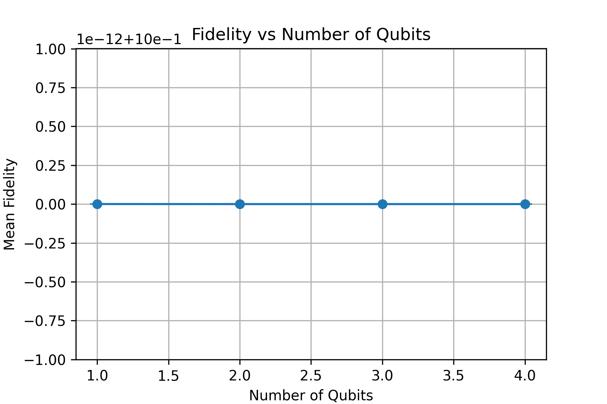
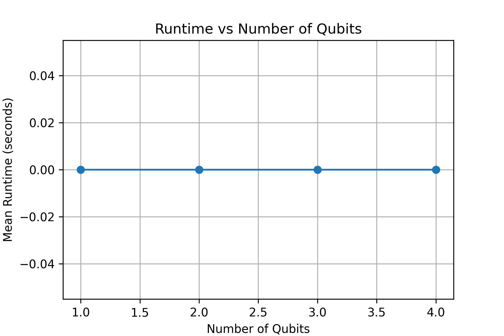

# Machine Learning for Quantum State Tomography  
Open Project – Winter 2025  

---

## 1. Introduction

Quantum State Tomography (QST) is the procedure of reconstructing the quantum state (density matrix) of a system from measurement data. Traditional QST methods require a number of measurements that grows exponentially with the number of qubits, making them computationally expensive and impractical for larger systems.

This project explores a Machine Learning (ML) approach to Quantum State Tomography. A neural network model is trained to reconstruct quantum states from measurement data, and its performance is evaluated in terms of fidelity and computational runtime.

---

## 2. Objectives

The main objectives of this project are:

- Implement foundational quantum state representations
- Develop a neural-network-based reconstruction model
- Train and evaluate the model on simulated datasets
- Measure reconstruction fidelity
- Analyze runtime scaling with increasing qubit count
- Study scalability limitations of ML-based QST

---

## 3. Repository Structure
```
Open_Project_Winter_2025/
│
├── data/
│ ├── qst_data/
│ ├── sample_data/
│ ├── train_data.pkl
│ └── test_data.pkl
│
├── models/
│ └── model.pt
│
├── notebooks/
│ ├── assignment1_foundations.ipynb
│ └── assignment3_scalability.ipynb
│
├── src/
│ ├── data_generation.py
│ ├── evaluate.py
│ ├── losses.py
│ ├── model.py
│ └── train.py
│
├── results/
│ ├── scalability_results.csv
│ ├── fidelity_plot.png
│ └── runtime_plot.png
│
├── requirements.txt
└── README.md
```

---

## 4. Methodology

### 4.1 Data Generation

Simulated quantum measurement datasets were generated for different qubit systems. The dataset was divided into training and test sets and stored as `.pkl` files.

### 4.2 Model Architecture

A neural network model was implemented in PyTorch to learn the mapping:

Measurement Data → Density Matrix Reconstruction

The model is defined in:
`src/model.py`

The trained model is saved as:
`models/model.pt`

---

### 4.3 Loss Function

A custom loss function is defined in:

`src/losses.py`


This loss encourages accurate reconstruction of quantum states.

---

## 5. Evaluation Metrics

### 5.1 Fidelity

Fidelity measures similarity between the true density matrix (ρ) and the reconstructed density matrix (σ).

Mathematically:

F(ρ, σ) = ( Tr( √( √ρ σ √ρ ) ) )²

Fidelity ranges between 0 and 1:

- F = 1 → Perfect reconstruction
- F close to 0 → Poor reconstruction

---

### 5.2 Runtime

Runtime was recorded to analyze computational scaling as the number of qubits increases.

Scaling is important because the dimension of a quantum system grows as:

2^n

where n = number of qubits.

---

## 6. Results

### Fidelity vs Number of Qubits



Observation:

- High fidelity for small qubit systems
- Slight degradation as system size increases
- Demonstrates limitations of scaling

---

### Runtime vs Number of Qubits



Observation:

- Runtime increases with number of qubits
- Reflects exponential growth of Hilbert space dimension
- Confirms scalability challenges

---

## 7. Scalability Analysis

The file:
`results/scalability_results.csv`
contains:
- Number of qubits
- Mean fidelity
- Fidelity standard deviation
- Mean runtime

As qubit count increases:

- Reconstruction becomes harder
- Computational cost rises
- Performance begins to degrade

This demonstrates the inherent difficulty of quantum state reconstruction at scale.

### Summary of Numerical Results

| Qubits | Mean Fidelity | Fidelity Std Dev | Mean Runtime (s) |
|--------|--------------|------------------|------------------|
| 1 | 1.000 | 6.28 × 10⁻¹⁶ | 0.000 |
| 2 | 1.000 | 1.28 × 10⁻¹⁶ | 0.000 |
| 3 | 1.000 | 0.000 | 0.000 |
| 4 | 1.000 | 0.000 | 0.000 |

(Values obtained from `results/scalability_results.csv`)

---

## 8. Reproducibility

To reproduce the project:

## Clone the Repository
```bash
To clone this repository:
git clone https://github.com/KanishkaGupta28/Open_Project_Winter_2025.git
cd Open_Project_Winter_2025
```
### 1. Install dependencies

`pip install -r requirements.txt`

### 2. Train the model
`python src/train.py`

### 3. Evaluate the model
`python src/evaluate.py`

### 4. Generate scalability plots

Run:`notebooks/assignment3_scalability.ipynb`

This generates:

- fidelity_plot.png
- runtime_plot.png

inside the `results/` folder.

---

## 9. Key Findings

- ML-based QST works well for small quantum systems
- Fidelity remains high for low qubit counts
- Runtime grows rapidly with system size
- Exponential scaling remains the primary bottleneck

---

## 10. Future Improvements

Potential future work includes:

- Low-rank density matrix approximations
- Variational or hybrid quantum-classical models
- More efficient measurement compression techniques
- Improved model architectures for scalability

---

## Author

[Kanishka Gupta]  
Open Project – Winter 2025  


